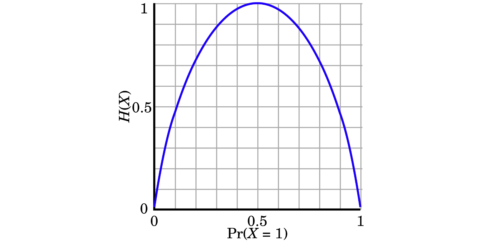

# 熵（信息论）

熵的概念起源于热力学，由香农将这一概念引入到了信息论中。这里的 **熵**，指的是 **香农熵**，即这里的熵是表示信息量的大小，而不是热力学中能量的多少。

## 自信息

[自信息]([https://zh.wikipedia.org/wiki/自信息](https://zh.wikipedia.org/wiki/%E8%87%AA%E4%BF%A1%E6%81%AF)) 是概率空间中单一事件的信息量的度量。简单的说，就是某一事件发生时，这个事件所携带的信息量的多少，比如：

> - 某个明星出轨了，大家非常关注，因为这个件事方发生的概率比较低，携带的信息量很大。
>
> - 小明妈妈今天买了一瓶酱油，大家并不关心，因为这个事件发生的概率比较高，携带的信息量比较小。

这样，就使我们产生一种想法：

> 不太可能发生的事件，当它发生了，那么这个事件相比于经常发生的事件，会提供更多的信息。

因此，我们就可以使用概率，作为变量，来描述某个事件 x 发生时的信息量$$ I(x) $$的大小：
$$
I(x) = f(p(x))
$$

上面公式中的函数 $$ f $$ 经常使用对数来表示：
$$
I(x) = log( \frac{1}{p(x)} ) = -log(p(x))
$$

对数的底数，经常使用的是 `2` ，即：
$$
I(x) = log_2( \frac{1}{p(x)} ) = -log_2(p(x))
$$
或者底数使用 `e` ，即：
$$
I(x)  = ln(\frac{1}{p(x)}) = -ln(p(x))
$$

> Tips: 
>
> - 为什么我们不直接使用概率来描述信息量的大小，而非要搞一个自信息的概念？没有太多原因，直接使用概率来描述，不太直观。
> - 为什么函数 $f$ 我们选择对数来计算？对数的一些特性，和自信息的一些特征相符，比如可加性等。

不太可能发生的事件，现在却意外的发生了，它发生的概率很小，发生后的信息量很大。

## 熵

首先，看生活中的这么一种现象：

> 一件不太可能发生的事件发生了，虽然很让人意外，自信息很大，但这样的事情毕竟比较少，不足以使得整个系统不稳定。但如果意外的事件频繁发生，这就会导致系统处于不确定的状态。这就说明了，影响一个系统的不确定性，除了事件的自信息的大小之外，事件发生的概率也是影响的因素之一。为了描述这种不确定性的程度，我们需要引用一个新概念，也就是下面要讲的 **熵**。

[熵](<https://zh.wikipedia.org/wiki/%E7%86%B5_(%E4%BF%A1%E6%81%AF%E8%AE%BA)>) 是离散随机变量的自信息的期望值。简单地说，就是系统内所有事件提供的信息量的平均值。

> 这里的所有事件，是指概率空间中的所有事件。比如，抛一枚硬币，概率空间中只有两个事件：正面朝上和反面朝上。

既然熵是自信息的期望值，那么，熵的公式就可以定义如下：
$$
H(X) = E[I(X)] = E(-log(P(X)))
$$
上面的 $$E$$ 表示 **期望函数**，随机变量 $$X$$ 的 **值域** 为 $$\{ x_1, x_2, ... , x_n \}$$ ，而 $$ I(X) $$ 就是 $$X$$ 的自信息，$$P$$ 就是 $$X$$ 的概率密度函数。对于离散型随机变量 $$X$$ ，往往取有限个样本，那么熵的公式可以表示为：
$$
H(X) = \sum_{i=1}^{i}{P(x_i) I(x_i)} = - \sum_{i=1}^{i}{P(x_i) logP(x_i)}
$$
为了简约，我们将上面的公式简写如下：
$$
H(X) = H(p) = - \sum_{i=1}^{i}{p_i log(p_i)}
$$
一个系统中，所有事件的自信息的平均值越大，那也就意味着，这个系统发生意外的可能性就越大。所以， **熵是用来描述系统的不确定性的。** 

> 这和生活中的感受是一致的：如果把某个明星出轨这件事情，看做一个系统，那么关于这个明星出轨的所有事件，构成了这个系统，这些事件往往是你难以预料的，它的不确定性就很高，也就是熵比较大。这样，携带的信息就比较多，需要用更多的文字去描述这个系统。反之，小明妈妈买酱油这件事情，稀松平常，不确定性比较低，与这件事情相关的所有事情，往往是可以预料的，熵就比较小，这样，携带的信息就比较少，不需要太多文字去描述这个系统。

从公式 $$- p_i log(p_i)$$ 也可以看出，自信息 $$-log(p_i)$$ 越大，并不意味着熵越大。下面是抛硬币的熵H(X)：



上图，描述了熵随着概率的改变而改变的情况（这里的熵的单位为：比特，即log的底数为2）。假设，抛一次硬币，正面朝上的概率不只是0.5，也可以是其它值，横轴表示正面朝上的概率值，概率值从0变化到1；纵轴的表示熵的变化，概率为0和1的时候，熵为0，概率为0.5的时候，熵的值1。这就表明了，**越随机的信息源，它的熵也就越大** 。

> 概率为0时，我们可以猜到，它不会发生；概率为1时，我们可以猜到，它一定会发生；当发生的概率为0.5时，我们就比较难猜测，它到底会发生哪种情况，难以预测下一次结果，到底是正面还是反面，说明它越随机。越随机，熵也就越大。

> 因为熵的定义，是可以通过公理来定义的。要解释一个公理，是比较困难的。
> 

## 交叉熵

先给出交叉熵的计算公式：
$$
H(p, q) = - \sum_{x}{p(x) \space log \space q(x)}
$$
其中，$$ p $$ 是真实分布，$$ q $$ 是错误分布。下面，将通过编码的例子，来说明交叉熵的实际意义。

### 编码需求

假设一个文本中，只有A、B、C这三个字母，类似如下：

```python
AAAAAAAAAAAAAAAAAAAAAAAAAAAAAAAAAAAAAAAAAAAAAAAA
AAAAAAAAAAAAAAAAAAAAAAAAAAAAAAAAAAAAAAAAAAAAAAAA
BBBBBBBBBBBBBBBBBBBBBBBBBBBBBBBBBBBBBBBBBBBB
CCCCCCCCCCCCCCCCCCCCCCCCCCCCCCCCCCCCCCCCCCCCCCCC
```

为了直观，我们将文本数量减少一点：

```python
AABC
```

计算机给字母编码时，使用的是二进制：0和1进行编码。使用 `0` 、`10` 、`11` 就可以表示三个字母。假设编码表示方式如下（`0`表示A，`10`表示B，`11`表示C。提示：你可能会问为什么不用 `1` ？这个问题一会再使用哈夫曼树来说明）：

```python
 0     --->    A
10     --->    B
11     --->    C
```

那么 `AABC` 这个字符串，就表示为：

```c
001011
```

上面只需 6 个bit位，但如果编码方式如下（`0`表示B，`10`表示A，`11`表示C）：

```python
 0     --->    B
10     --->    A
11     --->    C
```

那么 `AABC` 这个字符串，就表示为：

```python
1010011
```

上面编码就需要 7 个bit位。对比两种不同编码，分别是 6 个bit位和 7 个bit位。显然，如果只考虑bit位的数量的话，第一种编码更好，因为其使用的bit位的数量更少。从上面可以看出：

> 编码时，要考虑字母出现的频率：A 出现的频率更高，那么就应该把较短的编码分配给 A； B 和 C 出现的频率较低，就可以把较长的编码分配给 B 和 C。

这和式子 $$ p \times log(\frac{1}{p}) $$ 的增减趋势是一致的：概率 $$ p $$ 越大，即出现的频率越高，那么对应的编码长度就应该越小，即 $$ log(\frac{1}{p})$ $ 随着概率 $$ p $$ 的增大而变小 。为了描述这种变化，就引入了 **信息熵** 这个概念。

> Tips: 
>
> 这里，解释一下上面编码，为什么不能使用 `1` 代表 `ABC` 中的一个字母。下图是哈夫曼树：
>
> 
>
> 假设，我们使用 `0`表示A，`1`表示B，`10`表示C，那么，字符串 `ABC`的编码为：
>
> ```c
> 0110
> ```
>
> 那么，上面编码 `0110`，你就分不清楚，到底是 `ABC` 还是 `ABBA` ，也就是说，不能这样编码。

### 信息熵

信息熵是一个宽泛的概念，这里我们用编码的例子，来解释信息熵。假设，我们有以下文本：

```python
AAAAAAAAAAAAAAAAAAAAAAAAAAAAAAAAAAAAAAAAAAAAAAAA
AAAAAAAAAAAAAAAAAAAAAAAAAAAAAAAAAAAAAAAAAAAAAAAA
BBBBBBBBBBBBBBBBBBBBBBBBBBBBBBBBBBBBBBBBBBBB
CCCCCCCCCCCCCCCCCCCCCCCCCCCCCCCCCCCCCCCCCCCCCCCC
```

从文本中，随机取一个字符，取到 A 的概率为 $$ \frac{1}{2}$ $ ，取到 B 的概率为 $$ \frac{1}{4} $$ ，取到 C 的概率为 $$ \frac{1}{4} $$ 。随机取字符这件事，称为随机事件，取到的字符即随机变量X。随机变量X的概率分布情况，被称为随机变量X的分布。比如，上面文本中，随机变量取值的分布 p 为：
$$
A: \frac{1}{2},  \space \space  B: \frac{1}{4}, \space  \space  C: \frac{1}{4}
$$
这个分布，我们称为 **正确分布**，因为这个分布与事实相符，是根据事实统计得到的。这就是说，每4个字符里，就有 2 个 A，1 个 B，1 个 C。如果我们用 `0`表示A，`10`表示B，`11`表示C，那么每个字符的平均编码长度为：
$$
\frac{1 + 1 + 2 + 2}{4} = 1.5
$$
也就是每个字符，平均需要用 1.5 个bit位来表示。下面，使用熵的计算公式，计算上面的分布 p 的熵：
$$
H(X) = - \frac{1}{2}log_{2}{\frac{1}{2}} - \frac{1}{4}log_{2}{\frac{1}{4}} - \frac{1}{4}log_{2}{\frac{1}{4}} = 0.5 + 0.5 + 0.5 = 1.5
$$
正好也是1.5。为什么使用熵的计算公式，计算得到的结果恰好最小长度的编码呢？这个推断解释起来稍微复杂一些，在下面图书的 **第五章 数据压缩** 中有推导过程，使用 Kraft 不等式进行推导：

> 《信息论基础（第二版）》 - (美) Thomas M.Cover Joy A.Thomas 著      阮吉寿 张华 译

推导过程，不是这里要关注的重点，重点是，我们需要考虑一个问题：一个熵为 $$ H(X) $$ 的系统，我们至少需要多少信息来描述这个系统？换一句话来说：

> 假设信息是使用文本来描述的，单位为比特(bit)，那么，一个熵为 $$ H(X) $$ 的系统，一共需要多少比特来描述？平均每个字符需要多少个比特来描述？

比如，为了描述 `AABC` 的这个字符串，我们至少需要6个比特来描述（`001011`），平均每个字符至少需要 1.5 个比特来描述。所以，可以这么解释信息熵：

> 一个具有多个事件的系统，为每个事件添加最合适的描述信息，使得这些信息的平均值最小，这个平均值就是信息熵。

生活中，我们往往希望使用越少的文本，来描述一个东西，中文叫言简意赅，只要描述清楚了就可以了。还有，越少的文本，需要的存储空间就越小。所以，一般我们希望信息熵越小越好。

### 交叉熵

有了信息熵的概念，下面来解释交叉熵。还是上面的文本：

```python
AAAAAAAAAAAAAAAAAAAAAAAAAAAAAAAAAAAAAAAAAAAAAAAA
AAAAAAAAAAAAAAAAAAAAAAAAAAAAAAAAAAAAAAAAAAAAAAAA
BBBBBBBBBBBBBBBBBBBBBBBBBBBBBBBBBBBBBBBBBBBB
CCCCCCCCCCCCCCCCCCCCCCCCCCCCCCCCCCCCCCCCCCCCCCCC
```

通过文本，我们知道，`A` 、`B`、 `C` 的真实分布 p 为：
$$
A: \frac{1}{2},  \space \space  B: \frac{1}{4}, \space  \space  C: \frac{1}{4}
$$
假设我们不知道真实分布，我们使用一个错误的分布 q，我们假设 q 的分布如下：
$$
A: \frac{1}{4},  \space \space  B: \frac{1}{4}, \space  \space  C: \frac{1}{2}
$$
我们说，编码越短，应该分配给出现频率越高的字符，所以 C 被编码为 `0` ，而 A 编码为 `10`，B 编码为 `11` 。但实际上，上面的文本中，平均每4个字符，还是 2 个 A，1 个 B，1 个 C。所以，现在使用上面这种编码来对上面的文本进行编码，平均编码长度变成了：
$$
\frac{2 + 2 + 2 + 1}{4} = 1.75
$$
现在，每个字符平均需要用 1.75 个bit位来表示，而不是原来的 1.5 个bit位来表示。下面，使用交叉熵的计算公式，计算交叉熵 $$ H(p, q) $$ ：
$$
H(p, q) =  - \frac{1}{2}log_{2}{\frac{1}{4}} - \frac{1}{4}log_{2}{\frac{1}{4}} - \frac{1}{4}log_{2}{\frac{1}{2}} = 1 + 0.5 + 0.25 = 1.75
$$
正好也是1.75。这就是我们使用错误分布 q 进行编码后，平均每个字符需要的bit位。上面我们说：

> 一个具有多个事件的系统，为每个事件添加最合适的描述信息，使得这些信息的平均值最小，这个平均值就是信息熵。

那么交叉熵就是：

> 一个具有多个事件的系统，为每个事件添加描述信息时，没有添加最合适、最简约的描述信息，这时计算出的信息的平均值，就是交叉熵。

## 相对熵（KL散度）

[相对熵](<https://zh.wikipedia.org/wiki/%E7%9B%B8%E5%AF%B9%E7%86%B5>)，也叫做 KL 散度。理解了的信息熵和交叉熵，那么，相对熵就比较好理解了，相对熵就是：

> 对随机变量 X 进行编码，使用错误分布 q 编码时每个字符的平均长度，减去使用真实分布 p 编码时每个字符的平均长度，得到的 **差值** 就是相对熵。

比如，上面使用真实分布 p 得到的平均编码长度为1.5，使用错误分布得到的平均编码长度为1.75，差值就是相对熵：
$$
D_{KL}(p || q) = 1.75 - 1.5 = 0.25
$$
也就是说，使用错误分布编码，比使用真实分布编码，平均每个字符会多使用0.25个bit位。相对熵公式如下：
$$
\begin{aligned}
    D_{KL}{(P || Q)} 
            &= H(p, q) - H(p)   \\
            &= - \sum_{i}{P(i) \space log(Q(i))} - (- \sum_{i}{P(i) \space log(P(i)}))  \\
            &= - \sum_{i}{P(i) \space log{\frac{Q(i)}{P(i)}}}  \\
\end{aligned}
$$
**交叉熵 $$ H(P, Q) $$，减去信息熵 $$ H(P) $$，得到的差值，就是相对熵$$ D_{KL}{(P || Q)} $$**。